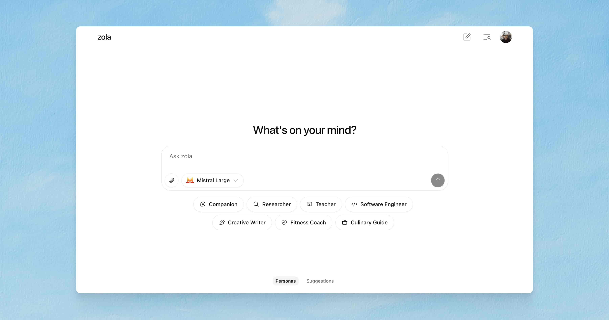

# Zola

[zola.chat](https://zola.chat)

**Zola** is a free, open-source AI chat app with multi-model support.

## Features

- multi-model support (OpenAI, Mistral, etc.)
- light and dark mode
- prompt suggestions
- file uploads
- mobile-friendly layout

## Installation

See [INSTALL.md](./INSTALL.md) for setup instructions.

## Built with

- [prompt-kit](https://prompt-kit.com/) — AI components
- [shadcn/ui](https://ui.shadcn.com) — core components
- [motion-primitives](https://motion-primitives.com) — animated components
- [vercel ai sdk](https://vercel.com/blog/introducing-the-vercel-ai-sdk) — model integration, AI features
- [supabase](https://supabase.com) — auth and storage

## License

Apache License 2.0

## Author
<a href="https://github.com/zehan12">
 
<b>Zehan Khan</b>
</a> 
<a href="https://github.com/zehan12/zola-ai/commits?author=zehan12" title="Code">💻</a>
